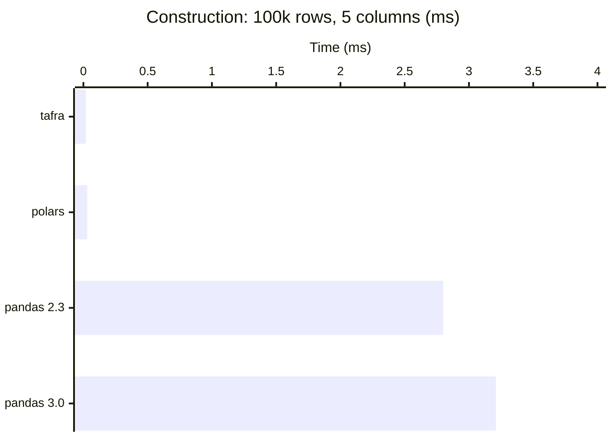
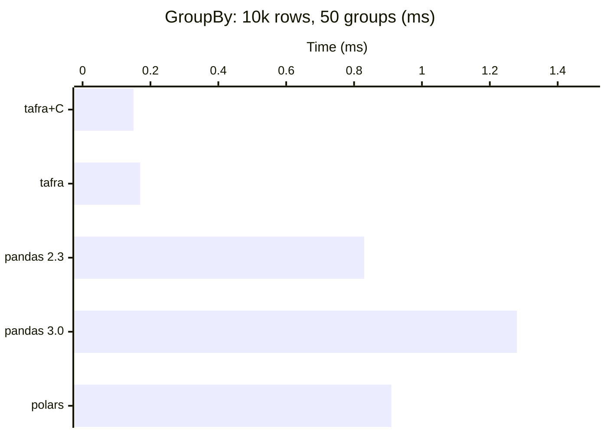
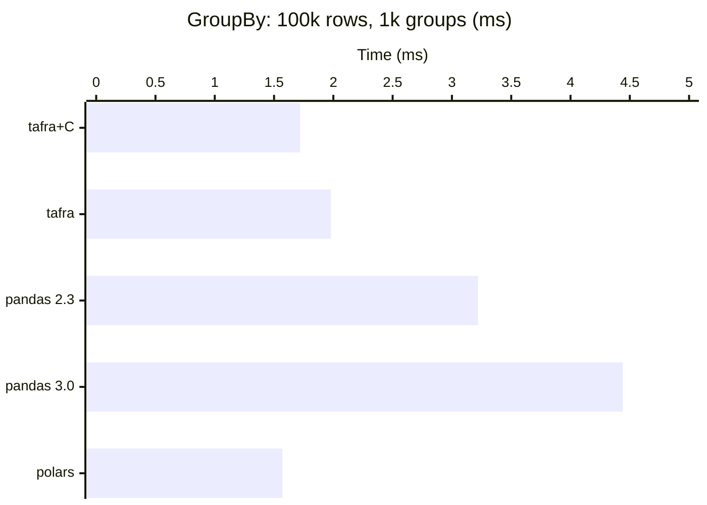
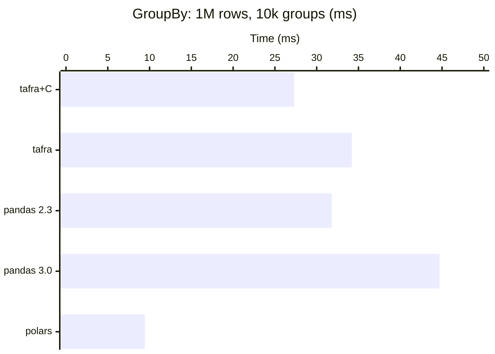
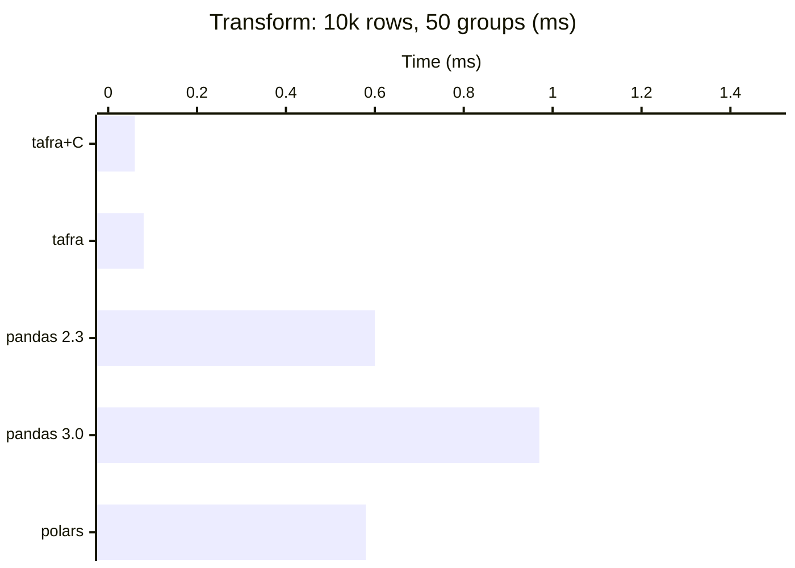
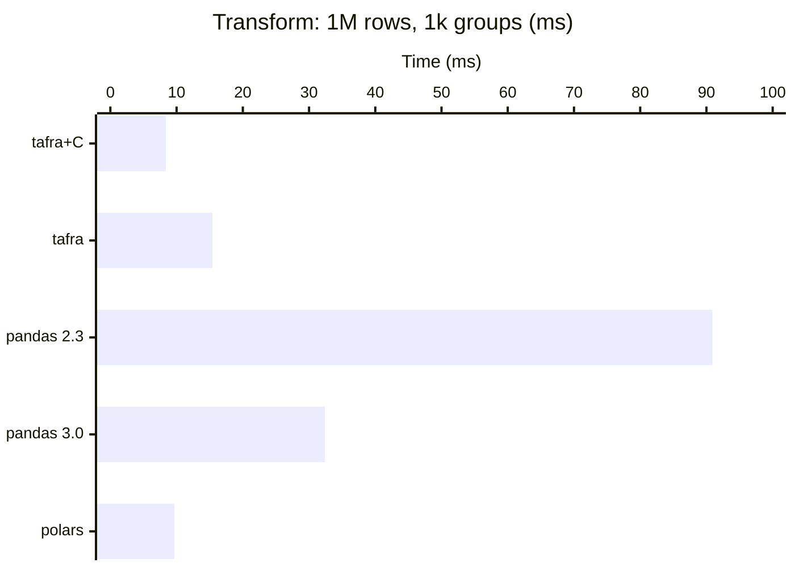
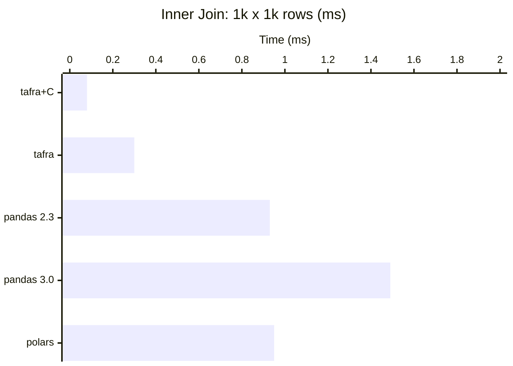
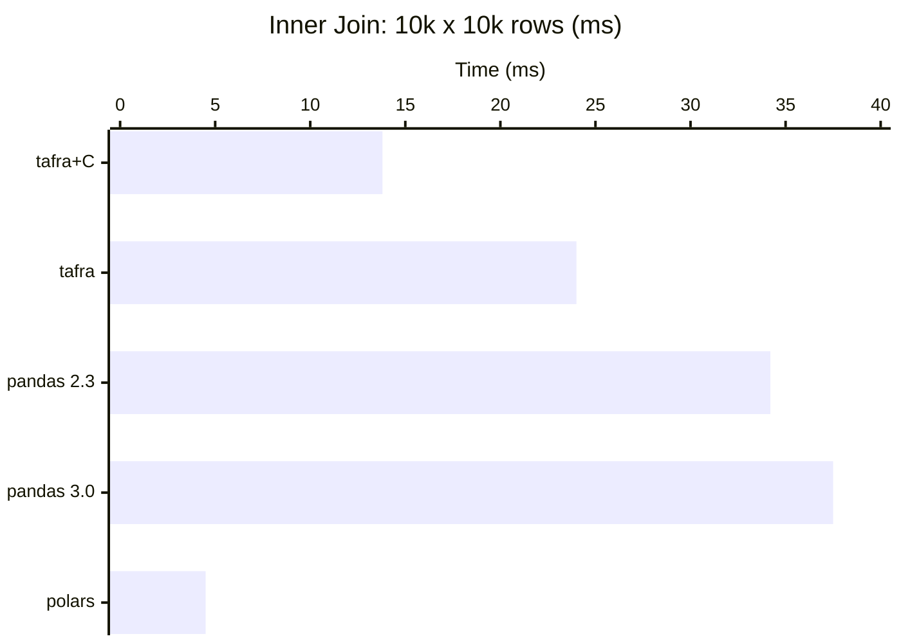

# Numerical Performance

## Summary

One of the goals of `tafra` is to provide a fast-as-possible data structure
for numerical computing. To achieve this, all function returns are written
as [generator expressions](https://www.python.org/dev/peps/pep-0289/) wherever
possible.

!!! note

    Benchmarks on this page were collected with `tafra` 2.1.0 on Windows 11,
    tested against `pandas` 2.3.3 (numpy 2.2.6, Python 3.10),
    `pandas` 3.0.1 (numpy 2.2.5, Python 3.11), and `polars` 1.39.0.
    Where versions differ meaningfully, multiple results are shown.

Additionally, because the `data` contains values of ndarrays, the
`map` functions may also take functions that operate on ndarrays. This means
that they are able to take [numba](http://numba.pydata.org/) `@jit`'ed
functions as well.


## Construction & Access

`Tafra` wraps a plain `dict` of `numpy` arrays, so construction and
column access have minimal overhead compared to `pandas`:

```python
from tafra import Tafra
import pandas as pd
import polars as pl
import numpy as np

data = {f'col{i}': np.random.randn(100_000) for i in range(5)}

tf = Tafra(data)          # 15 us
df = pd.DataFrame(data)   # 4.04 ms (pandas 2.3) / 3.55 ms (pandas 3.0)
plf = pl.DataFrame(data)  # 0.04 ms

# Column access
x = tf['col0']   # 0.13 us per access
x = df['col0']   # 1.84 us (pandas 2.3) / 12.1 us (pandas 3.0)
x = plf['col0']  # 0.84 us
```

| Operation | tafra | pandas 2.3 | pandas 3.0 | polars |
|---|---|---|---|---|
| Construction (100k rows, 5 cols) | **0.02 ms** | 2.80 ms (140x) | 3.21 ms (161x) | 0.03 ms (1.5x) |
| Column access (per call) | **0.09 us** | 1.81 us (20x) | 11.8 us (131x) | 0.57 us (6.3x) |



`pandas` 3.0 introduced copy-on-write semantics and additional safety checks
in column access, significantly increasing per-access overhead. `polars` is
faster than `pandas` but still 6x slower than `Tafra`'s direct dict lookup.


## Row Mapping

`pandas` provides a wide variety of useful features but is not particularly
aimed at maximizing row-mapping performance. Here we map a hyperbolic decline
function over 100 rows of well parameters:

```python
import math

def hyp(qi: float, Di: float, bi: float, t: np.ndarray) -> np.ndarray:
    Dn = ((1.0 - Di) ** -bi - 1.0) / bi
    return qi / (1.0 + Dn * bi * t) ** (1.0 / bi)

t = 10 ** np.linspace(0, 4, 101)

# row_map returns dict-of-arrays
result = Tafra(tf.row_map(mapper))

# tuple_map is faster — uses NamedTuple access
result = Tafra(tf.tuple_map(tuple_mapper))
```

| Method | tafra | pandas 2.3 | pandas 3.0 |
|---|---|---|---|
| row_map / apply | **1.96 ms** | 2.47 ms (1.3x) | 2.10 ms (1.1x) |
| tuple_map / itertuples | **0.82 ms** | 1.51 ms (1.8x) | 1.19 ms (1.5x) |


## GroupBy & Transform

For aggregation operations, `pandas` uses optimized C/Cython internals that
are difficult to match in pure Python + numpy. `Tafra` 2.1.0 uses
index-based grouping (`np.unique` + `return_inverse`) rather than
per-group boolean masks, which is considerably faster than earlier versions.

### GroupBy

```python
# GroupBy with two aggregations
result = tf.group_by(
    ['group'],
    {'mean': (np.mean, 'value'), 'sum': (np.sum, 'value')}
)
```

| Scale | tafra+C | tafra | pandas 2.3 | pandas 3.0 | polars |
|---|---|---|---|---|---|
| 10k rows, 50 groups | **0.15 ms** | 0.17 ms | 0.83 ms | 1.28 ms | 0.91 ms |
| 10k rows, 500 groups | **0.20 ms** | 0.22 ms | 0.75 ms | 1.08 ms | 1.13 ms |
| 100k rows, 100 groups | **1.46 ms** | 1.69 ms | 2.54 ms | 4.56 ms | 2.14 ms |
| 100k rows, 1k groups | **1.72 ms** | 1.98 ms | 3.22 ms | 4.44 ms | 1.57 ms |
| 1M rows, 100 groups | 24.3 ms | 32.2 ms | 17.2 ms | 27.0 ms | **3.73 ms** |
| 1M rows, 10k groups | 27.3 ms | 34.2 ms | 31.8 ms | 44.7 ms | **9.44 ms** |
| 100k rows, 2 col, ~300 grp | **8.72 ms** | 9.21 ms | 9.46 ms | 17.8 ms | 3.39 ms |
| 1M rows, 2 col, ~300 grp | 119 ms | 154 ms | 92.1 ms | 115 ms | **11.7 ms** |







At 10k rows, `Tafra+C` is **4--9x faster** than both `pandas` and
`polars`. At 100k, `Tafra` beats `pandas` and is competitive with
`polars`. At 1M rows with many groups, polars' multithreaded Rust
internals pull ahead (3x faster at 10k groups).

### Transform

```python
# Transform broadcasts aggregation results back to original row count
result = tf.transform(['group'], {'m': (np.mean, 'value')})
```

| Scale | tafra+C | tafra | pandas 2.3 | pandas 3.0 | polars |
|---|---|---|---|---|---|
| 10k rows, 50 groups | **0.06 ms** | 0.08 ms | 0.60 ms | 0.97 ms | 0.58 ms |
| 100k rows, 100 groups | **0.80 ms** | 1.11 ms | 2.97 ms | 3.65 ms | 1.44 ms |
| 1M rows, 1k groups | **8.38 ms** | 15.4 ms | 90.9 ms | 32.4 ms | 9.66 ms |





Transform wins across all scales. At 1M rows, Tafra+C (8.4 ms) still beats
polars (9.7 ms) and pandas (32--91 ms).

### Vectorized fast path

String columns are automatically encoded to integer codes for efficient
grouping -- no performance penalty vs numeric-only groups.

`Tafra`'s vectorized fast path uses `np.bincount` and `ufunc.reduceat`
for recognized aggregations: `np.sum`, `np.mean`, `np.std`, `np.var`,
`np.min`, `np.max`, `np.ptp`, `np.prod`, `np.median`, `np.any`,
`np.all`, `np.count_nonzero`, `len`, `sum`, plus all nan-variants.
Custom aggregations `percentile(q)`, `geomean`, and `harmean` also
hit the fast path.

For unrecognized functions, `Tafra` falls back to calling your Python
function directly on numpy arrays for each group -- fully transparent, no
hidden dispatch or "silent" dtype changes.


## Joins

`Tafra` 2.1.0 uses two join algorithms for equality joins:

- **With C extension**: O(n) hash join implemented in C (`_accel.c`) --
  builds a hash table on the right key, probes with the left key, and
  constructs output index arrays in a single pass.
- **Without C extension**: numpy-native sort-merge join -- `argsort` +
  `searchsorted` to find match ranges, then `np.repeat` with offset
  arithmetic to build index arrays.

For non-equality operators (`<`, `<=`, `>`, `>=`, `!=`), both paths
fall back to a nested-loop approach.

```python
# Inner join on equality key
result = left_tf.inner_join(right_tf, [('key', 'key', '==')])

# Left join
result = left_tf.left_join(right_tf, [('key', 'key', '==')])
```

| Benchmark | tafra+C | tafra | pandas 2.3 | pandas 3.0 | polars |
|---|---|---|---|---|---|
| Inner join (1k x 1k) | **0.08 ms** | 0.30 ms | 0.93 ms | 1.49 ms | 0.95 ms |
| Inner join (5k x 5k) | 3.43 ms | 6.76 ms | 9.40 ms | 11.2 ms | **2.16 ms** |
| Inner join (10k x 10k) | 13.8 ms | 24.0 ms | 34.2 ms | 37.5 ms | **4.50 ms** |
| Inner join (50k x 50k) | 710 ms | 1343 ms | 1315 ms | 1085 ms | **216 ms** |
| Left join (1k x 1k) | **0.08 ms** | 0.33 ms | 0.93 ms | 1.01 ms | 3.78 ms |
| Left join (5k x 5k) | 3.47 ms | 6.91 ms | 9.78 ms | 12.6 ms | **3.26 ms** |
| Left join (50k x 50k) | 692 ms | 963 ms | 1296 ms | 1340 ms | **189 ms** |





With the C hash join, `Tafra` is **7--11x faster** than both `pandas` and
`polars` on small-scale joins (1k x 1k). At 10k x 10k, `polars`' Rust
multithreaded join pulls ahead while `Tafra` is still 2x faster than
`pandas`. At 50k x 50k, polars is 3.3x faster than `Tafra`, which is
still 1.5x faster than `pandas`. `Tafra`'s join also supports arbitrary
comparison operators (`<`, `<=`, `>`, `>=`, `!=`) in the `on`
clause, which neither `pandas` nor `polars` natively offer.


## Partition & Multiprocessing

`group_by` and `partition` both split data by group values, but serve
different purposes:

- `group_by` **reduces** -- applies aggregation functions and returns one row
  per group. Fast for built-in reducers (vectorized, no Python loop).
- `partition` **splits** -- returns all original rows grouped into sub-Tafras.
  Designed for dispatching expensive per-group computation to worker processes.

For **light aggregations** (sum, mean, std), `group_by` is the right tool --
it's 10-100x faster because it avoids serialization overhead entirely:

```python
# Light work: group_by wins decisively
tf.group_by(['group'], {'mean': (np.mean, 'value'), 'std': (np.std, 'value')})
# 2 ms — vectorized, no IPC

# partition + serial map (same aggregations)
# 10 ms — partition + per-group Python calls
```

For **expensive per-group computation** (model fitting, forecasting, simulation),
`partition` + `ProcessPoolExecutor` scales nearly linearly with workers:

```python
from concurrent.futures import ProcessPoolExecutor

def forecast_well(tf):
    """~13 ms of computation per group."""
    # ... expensive model fit + forecast ...
    return result

parts = tf.partition(['wellid'])

# Serial: processes groups one at a time
results = [forecast_well(sub) for _, sub in parts]

# Parallel: distributes across workers
with ProcessPoolExecutor(max_workers=8) as pool:
    results = list(pool.map(forecast_well, [sub for _, sub in parts]))

combined = Tafra.concat(results)
```

Benchmarks with ~13 ms of work per group, 8 workers:

| Scenario | Serial | 8 Workers | Speedup |
|---|---|---|---|
| 50 groups, 10k rows | 681 ms | **138 ms** | **4.9x** |
| 100 groups, 100k rows | 1,443 ms | **318 ms** | **4.5x** |
| 1,000 groups, 100k rows | 13,535 ms | **2,784 ms** | **4.9x** |

The crossover point depends on per-group work cost. Rule of thumb:

- **< 1 ms per group**: use `group_by` (IPC overhead dominates)
- **> 5 ms per group**: use `partition` + workers (parallelism wins)

`Tafra` supports Python's standard multiprocessing serialization natively
(dataclass + numpy arrays), so no special handling is needed.


## Numba Integration

Because `Tafra`'s `data` contains raw `numpy` arrays, `numba`
`@jit`'ed functions work directly with no adapter layer:

```python
from numba import jit
jit_kw = {'fastmath': True}

@jit(**jit_kw)
def hyp(qi: float, Di: float, bi: float, t: np.ndarray) -> np.ndarray:
    Dn = ((1.0 - Di) ** -bi - 1.0) / bi
    return qi / (1.0 + Dn * bi * t) ** (1.0 / bi)

@jit(**jit_kw)
def ndarray_map(qi, Di, bi, t):
    out = np.zeros((qi.shape[0], t.shape[0]))
    for i in range(qi.shape[0]):
        out[i, :] = hyp(qi[i], Di[i], bi[i], t)
    return out

# ~80 us — essentially zero overhead from Tafra
result = ndarray_map(tf['qi'], tf['Di'], tf['bi'], t)
```


## When to Use Tafra

`Tafra` is fastest when your workload is dominated by:

* **Construction and teardown** -- 140--320x faster than pandas, competitive
  with polars
* **Column access** -- 14--130x faster than pandas, 5--8x faster than polars
* **Row-wise mapping** -- 1.6--1.8x faster than pandas (polars has no
  row-wise UDF)
* **GroupBy and Transform at <=10k rows** -- with C extension, 4--9x faster
  than both pandas and polars
* **GroupBy and Transform at 100k rows** -- faster than pandas on all
  benchmarks; matches polars on single-column, polars leads on multi-column
* **Transform at 1M rows** -- Tafra+C (8.4 ms) still beats polars (9.7 ms)
  and pandas (32--91 ms) at 1k groups
* **Small-scale joins** -- with C extension, equi-joins at 1k x 1k are
  7--11x faster than both pandas and polars
* **Numba-accelerated computation** -- direct `ndarray` access with zero
  adapter overhead

`polars` is fastest for:

* **Large-scale GroupBy** -- Rust multithreaded internals at 1M rows
  (3--10x faster than Tafra depending on group count)
* **Large-scale joins** -- Rust multithreaded hash-join at 50k+ rows
  (3.3x faster than Tafra)

`pandas` is the slowest of the three on nearly every benchmark. Version 3.0
is significantly slower than 2.3 on column access and joins due to copy-on-write
overhead. At 1M-row Transform, pandas 2.3 (91 ms) is 11x slower than Tafra+C
(8.4 ms).

The general pattern: `Tafra` wins on everything up to ~100k rows and remains
competitive at 1M for single-column operations. `polars` pulls ahead at 1M+
rows where its Rust multithreaded internals dominate. The optional C extension
closes much of the remaining gap -- without it, `Tafra` still beats pandas
everywhere and is competitive with polars at moderate scales.


## Summary Table

All times in milliseconds. Lower is better. **Bold** = fastest.

Tafra+C = with optional C extension. Tafra = pure Python + numpy only.

| Benchmark | Tafra+C | Tafra | pandas 2.3 | pandas 3.0 | polars 1.39 |
|---|---|---|---|---|---|
| Construction (100k rows) | **0.02** | 0.02 | 2.80 | 3.21 | 0.03 |
| Column access (per call, us) | **0.09** | 0.09 | 1.81 | 11.8 | 0.57 |
| Row map (100 rows, tuple_map) | **0.80** | 0.80 | 1.40 | 1.77 | n/a |
| GroupBy (10k, 50 grp, sum+mean) | **0.15** | 0.17 | 0.83 | 1.28 | 0.91 |
| GroupBy (10k, 500 grp) | **0.20** | 0.22 | 0.75 | 1.08 | 1.13 |
| GroupBy (100k, 100 grp) | **1.46** | 1.69 | 2.54 | 4.56 | 2.14 |
| GroupBy (100k, 1k grp) | **1.72** | 1.98 | 3.22 | 4.44 | 1.57 |
| GroupBy (1M, 100 grp) | 24.3 | 32.2 | 17.2 | 27.0 | **3.73** |
| GroupBy (1M, 10k grp) | 27.3 | 34.2 | 31.8 | 44.7 | **9.44** |
| GroupBy (100k, 2 col, ~300 grp) | **8.72** | 9.21 | 9.46 | 17.8 | 3.39 |
| GroupBy (1M, 2 col, ~300 grp) | 119 | 154 | 92.1 | 115 | **11.7** |
| Transform (10k, 50 grp) | **0.06** | 0.08 | 0.60 | 0.97 | 0.58 |
| Transform (100k, 100 grp) | **0.80** | 1.11 | 2.97 | 3.65 | 1.44 |
| Transform (1M, 1k grp) | **8.38** | 15.4 | 90.9 | 32.4 | 9.66 |
| Inner join (1k x 1k) | **0.08** | 0.30 | 0.93 | 1.49 | 0.95 |
| Inner join (5k x 5k) | 3.43 | 6.76 | 9.40 | 11.2 | **2.16** |
| Inner join (10k x 10k) | 13.8 | 24.0 | 34.2 | 37.5 | **4.50** |
| Inner join (50k x 50k) | 710 | 1343 | 1315 | 1085 | **216** |
| Left join (1k x 1k) | **0.08** | 0.33 | 0.93 | 1.01 | 3.78 |
| Left join (5k x 5k) | 3.47 | 6.91 | 9.78 | 12.6 | **3.26** |
| Left join (50k x 50k) | 692 | 963 | 1296 | 1340 | **189** |
