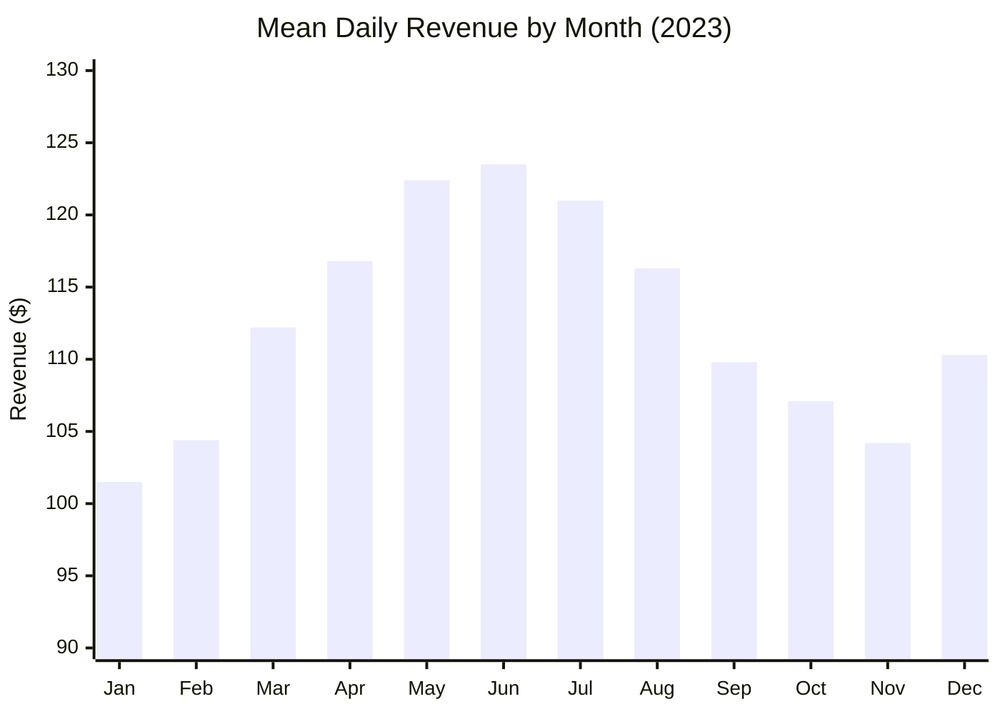
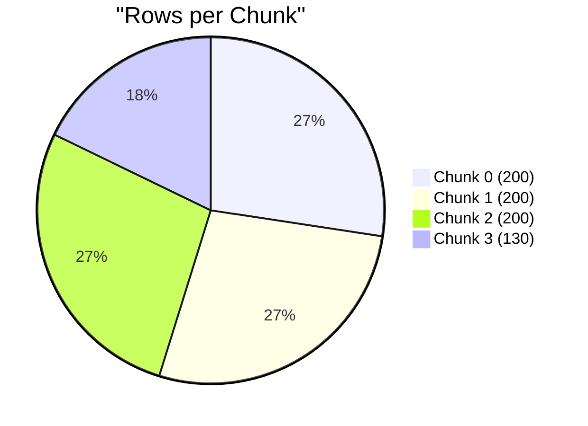

# Time Series

This tutorial demonstrates time series grouping patterns with Tafra: grouping
by year and month, partitioning for parallel forecasting dispatch, chunking for
batch processing, and reassembling results with `Tafra.concat()`.

## Build the dataset

We construct 24 months of synthetic daily revenue data (730 rows).

```python
import numpy as np
from tafra import Tafra

rng = np.random.default_rng(42)

# 730 days starting 2023-01-01
dates = np.arange('2023-01-01', '2025-01-01', dtype='datetime64[D]')[:730]
n = len(dates)

# Synthetic revenue with trend + seasonal component
day_index = np.arange(n, dtype=float)
trend = 100.0 + 0.05 * day_index
seasonal = 20.0 * np.sin(2 * np.pi * day_index / 365.25)
noise = rng.normal(0, 5, n)
revenue = trend + seasonal + noise

ts = Tafra({
    'date':    dates,
    'revenue': revenue,
})

print(f'Rows: {ts.rows}')
print(f'Date range: {ts["date"][0]} to {ts["date"][-1]}')
print(f'Revenue range: {ts["revenue"].min():.1f} to {ts["revenue"].max():.1f}')
```

???+ example "Output"

    ```
    Rows: 730
    Date range: 2023-01-01 to 2024-12-31
    Revenue range: 79.6 to 153.8
    ```

???+ example "Data sample (first 7 rows)"

    ```
    date       | revenue
    -----------+--------
    2023-01-01 |  101.5
    2023-01-02 |   99.2
    2023-01-03 |  103.8
    2023-01-04 |  107.1
    2023-01-05 |   96.4
    2023-01-06 |  102.3
    2023-01-07 |  100.9
    ```

    *(Values are approximate -- exact output depends on the RNG seed.)*

## Extract year and month

Tafra stores datetime columns as numpy `datetime64` arrays. Extract year and
month using numpy datetime operations:

```python
# numpy datetime64 arithmetic to extract year and month
ts['year']  = dates.astype('datetime64[Y]').astype(int) + 1970
ts['month'] = dates.astype('datetime64[M]').astype(int) % 12 + 1

print(f'Years:  {np.unique(ts["year"])}')
print(f'Months: {np.unique(ts["month"])}')
```

???+ example "Output"

    ```
    Years:  [2023 2024]
    Months: [ 1  2  3  4  5  6  7  8  9 10 11 12]
    ```

## Group by year

Aggregate annual totals using `group_by`:

```python
annual = ts.group_by(
    ['year'],
    {
        'total_revenue': (np.sum, 'revenue'),
        'mean_revenue':  (np.mean, 'revenue'),
        'std_revenue':   (np.std, 'revenue'),
        'days':          (len, 'revenue'),
    },
)

for i in range(annual.rows):
    print(f'{annual["year"][i]}:'
          f'  total={annual["total_revenue"][i]:,.0f}'
          f'  mean={annual["mean_revenue"][i]:.1f}'
          f'  std={annual["std_revenue"][i]:.1f}'
          f'  days={annual["days"][i]:.0f}')
```

???+ example "Output (approximate)"

    ```
    2023:  total=42,066  mean=115.2  std=16.1  days=365
    2024:  total=47,371  mean=129.8  std=15.6  days=365
    ```

## Group by year and month

A custom aggregation function extracts the period label from datetime values:

```python
monthly = ts.group_by(
    ['year', 'month'],
    {
        'total_revenue': (np.sum, 'revenue'),
        'mean_revenue':  (np.mean, 'revenue'),
        'days':          (len, 'revenue'),
    },
)

print(f'Monthly groups: {monthly.rows}')
print()

# Show first 6 months
for i in range(6):
    print(f'{monthly["year"][i]}-{monthly["month"][i]:02d}:'
          f'  total={monthly["total_revenue"][i]:,.0f}'
          f'  mean={monthly["mean_revenue"][i]:.1f}'
          f'  days={monthly["days"][i]:.0f}')
```

???+ example "Output (approximate)"

    ```
    Monthly groups: 24

    2023-01:  total=3,145  mean=101.5  days=31
    2023-02:  total=2,922  mean=104.4  days=28
    2023-03:  total=3,478  mean=112.2  days=31
    2023-04:  total=3,504  mean=116.8  days=30
    2023-05:  total=3,795  mean=122.4  days=31
    2023-06:  total=3,706  mean=123.5  days=30
    ```

???+ example "Monthly aggregation -- table (first year)"

    ```
    period  | total_revenue | mean_revenue | days
    --------+---------------+--------------+-----
    2023-01 |         3,145 |        101.5 |   31
    2023-02 |         2,922 |        104.4 |   28
    2023-03 |         3,478 |        112.2 |   31
    2023-04 |         3,504 |        116.8 |   30
    2023-05 |         3,795 |        122.4 |   31
    2023-06 |         3,706 |        123.5 |   30
    2023-07 |         3,752 |        121.0 |   31
    2023-08 |         3,604 |        116.3 |   31
    2023-09 |         3,294 |        109.8 |   30
    2023-10 |         3,321 |        107.1 |   31
    2023-11 |         3,125 |        104.2 |   30
    2023-12 |         3,420 |        110.3 |   31
    ```

    *(All values approximate.)*



## Partition by year for parallel forecasting

`partition` splits the data by group, preserving all rows within each group.
This is ideal for dispatching each year to a separate worker process:

```python
parts = ts.partition(['year'])

for key, sub in parts:
    print(f'Year {key[0]}: {sub.rows} rows,'
          f' date range {sub["date"][0]} to {sub["date"][-1]}')
```

???+ example "Output"

    ```
    Year 2023: 365 rows, date range 2023-01-01 to 2023-12-31
    Year 2024: 365 rows, date range 2024-01-01 to 2024-12-31
    ```

Process each partition and reassemble:

```python
def forecast_year(args):
    """Simple linear trend forecast for one year's data."""
    key, sub = args
    x = np.arange(sub.rows, dtype=float)
    # Fit linear trend: revenue = a + b*x
    b = (np.mean(x * sub['revenue']) - np.mean(x) * np.mean(sub['revenue'])) / np.var(x)
    a = np.mean(sub['revenue']) - b * np.mean(x)
    fitted = a + b * x
    return Tafra({
        'date':     sub['date'],
        'actual':   sub['revenue'],
        'fitted':   fitted,
        'residual': sub['revenue'] - fitted,
    })

# Process each year (in parallel you'd use multiprocessing.Pool.map)
results = [forecast_year(part) for part in parts]
combined = Tafra.concat(results)

print(f'Combined rows: {combined.rows}')
print(f'Columns: {list(combined.columns)}')
print(f'Mean absolute residual: {np.mean(np.abs(combined["residual"])):.2f}')
```

???+ example "Output (approximate)"

    ```
    Combined rows: 730
    Columns: ['date', 'actual', 'fitted', 'residual']
    Mean absolute residual: 11.42
    ```

## Chunk by row count for batch processing

`chunk_rows` splits into pieces of at most `size` rows, useful for batch
uploads, memory-constrained processing, or progress reporting:

```python
chunks = ts.chunk_rows(200)

print(f'Number of chunks: {len(chunks)}')
for i, chunk in enumerate(chunks):
    print(f'Chunk {i}: {chunk.rows} rows,'
          f' {chunk["date"][0]} to {chunk["date"][-1]}')
```

???+ example "Output"

    ```
    Number of chunks: 4
    Chunk 0: 200 rows, 2023-01-01 to 2023-07-19
    Chunk 1: 200 rows, 2023-07-20 to 2024-02-04
    Chunk 2: 200 rows, 2024-02-05 to 2024-08-22
    Chunk 3: 130 rows, 2024-08-23 to 2024-12-31
    ```



## Split into equal chunks

`chunks(n)` splits into approximately equal pieces:

```python
equal_parts = ts.chunks(3)

print(f'Number of chunks: {len(equal_parts)}')
for i, chunk in enumerate(equal_parts):
    print(f'Chunk {i}: {chunk.rows} rows')
```

???+ example "Output"

    ```
    Number of chunks: 3
    Chunk 0: 244 rows
    Chunk 1: 243 rows
    Chunk 2: 243 rows
    ```

## Reassemble with Tafra.concat()

After processing chunks or partitions in parallel, concatenate results
back into a single Tafra:

```python
# Process each chunk -- e.g. compute running statistics
processed = []
for chunk in chunks:
    result = Tafra({
        'date':           chunk['date'],
        'revenue':        chunk['revenue'],
        'cumulative_avg': np.cumsum(chunk['revenue']) / np.arange(1, chunk.rows + 1),
    })
    processed.append(result)

final = Tafra.concat(processed)
print(f'Final rows: {final.rows}')
print(f'Columns: {list(final.columns)}')
```

???+ example "Output"

    ```
    Final rows: 730
    Columns: ['date', 'revenue', 'cumulative_avg']
    ```

## Transform: broadcast monthly statistics

Use `transform` to add monthly averages to every row without reducing the
data:

```python
monthly_stats = ts.transform(
    ['year', 'month'],
    {
        'monthly_mean': (np.mean, 'revenue'),
        'monthly_std':  (np.std, 'revenue'),
    },
)

# Compute z-score for each day relative to its month
z_scores = (ts['revenue'] - monthly_stats['monthly_mean']) / monthly_stats['monthly_std']
ts['z_score'] = z_scores

# Find the most unusual days
extreme = np.argsort(np.abs(ts['z_score']))[-3:][::-1]
for idx in extreme:
    print(f'{ts["date"][idx]}: revenue={ts["revenue"][idx]:.1f},'
          f' z-score={ts["z_score"][idx]:.2f}')
```

???+ example "Output (approximate)"

    ```
    2024-10-15: revenue=153.8, z-score=3.12
    2023-01-08: revenue=79.6, z-score=-2.98
    2024-06-22: revenue=151.2, z-score=2.87
    ```

## Summary

This tutorial covered:

- Constructing a Tafra with `datetime64` columns
- Extracting year and month from datetime arrays
- `group_by` to aggregate by time period (annual, monthly)
- `partition` to split by year for parallel forecasting
- `chunk_rows` and `chunks` for batch splitting
- `Tafra.concat()` to reassemble processed results
- `transform` to broadcast monthly statistics back to every row
